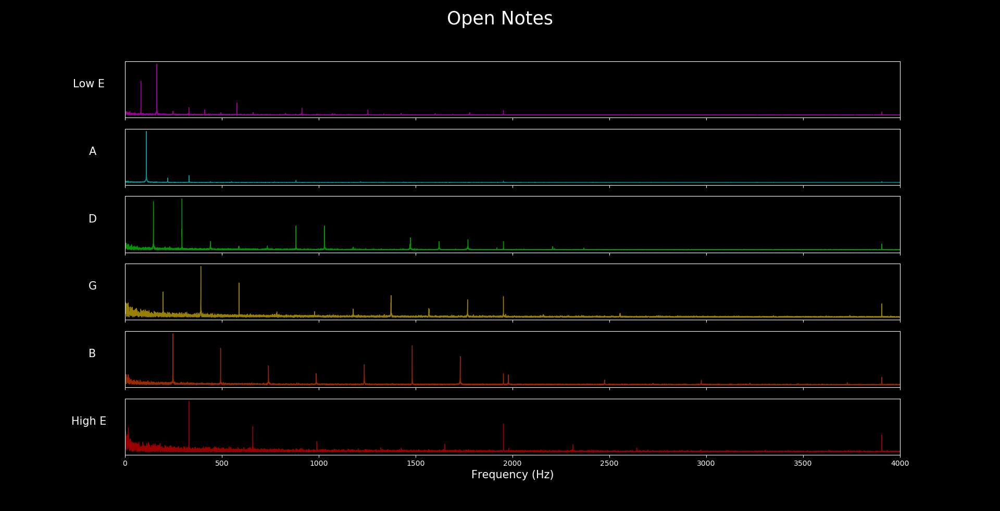
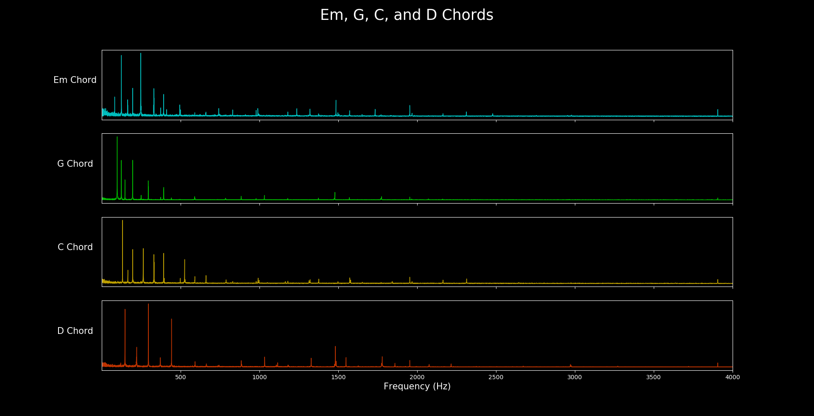

# guitar-fourier-transform

Using matlab and a microphone on a headset, audio from my guitar was recorded and the Fourier transform was performed on the audio data. The data was then exported in a CSV file. In Python, the data was processed and the graphs created. It is interesting to see the relative amplitudes of the overtones. On the low e string, the second harmonic (first overtone) actually has a higher amplitude than the fundamental.

To see all of the details clearly, I recommend opening the picture in full screen.

The graph below shows the Fourier transform of some chords.

